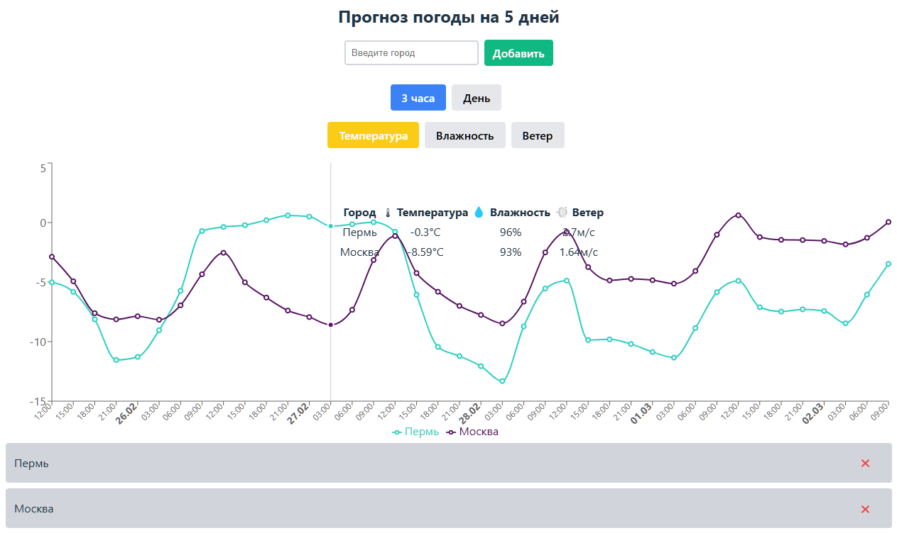

# Weather Forecast App for WhoIsBlogger (WIB)

## 📌 Описание проекта
Приложение для отображения прогноза погоды на 5 дней по введённому пользователем городу. Данные загружаются с **OpenWeatherMap API**. Графики отображаются с использованием **Recharts**.

## 🚀 Стэк технологий
- **TypeScript + React**
- **Recharts** (для построения графиков)
- **Axios** (для работы с API)
- **StyledComponents**

## 🔧 Установка и запуск

### 1. Клонируйте репозиторий
```sh
git clone https://github.com/MerzlyakovVasiliy/weather-app.git
cd weather-app
```

### 2. Установите зависимости
```sh
npm install
```

### 3. Настройте переменные окружения
Создайте файл `.env` в корне проекта и добавьте API-ключ OpenWeatherMap:
```env
VITE_OPENWEATHER_API_KEY=your_api_key_here
```
⚠ **Важно:** Получите API-ключ на [openweathermap.org](https://home.openweathermap.org/api_keys).

### 4. Запустите проект
```sh
npm run dev
```

## 🎯 Функционал
- ✔ Ввод города для получения прогноза погоды
- ✔ Отображение графика температуры на 5 дней
- ✔ Отображение дополнительных метрик по наведению на точку графика (*опционально*)
- ✔ Выбор параметра для графика (температура / давление / влажность / ветер) (*опционально*)
- ✔ Выбор гранулярности графика (3 часа / день) (*опционально*)
- ✔ Возможность добавления нескольких городов для сравнения (*опционально*)

## 📌 API-эндпоинты
- **[Прогноз на 5 дней](https://api.openweathermap.org/data/2.5/forecast?q=${city}&appid=${API_KEY}&units=metric&lang=ru)** — получает прогноз погоды по названию города

## 📷 Превью



